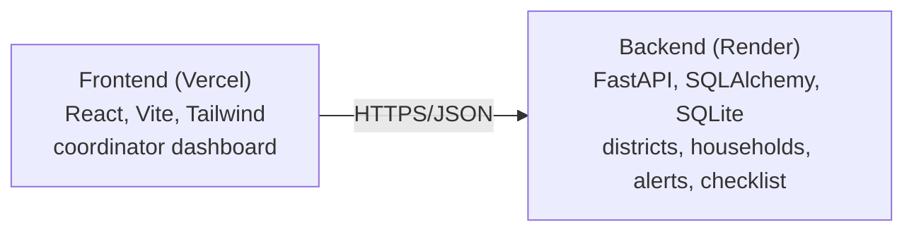

# Baadh Mitra — Flood Relay Coordinator

[](https://baadh-mitra.vercel.app/)


Turns a flood alert into a prioritized, door-to-door warning checklist for volunteer relay teams.

**Live:** https://baadh-mitra.vercel.app/

## What this project does

Baadh Mitra is a coordinator tool for that last mile. A volunteer team maps their district's households once (elevation, whether the household is elderly-only, whether anyone there owns a smartphone, mobility limitations), and every time an alert comes in, the app turns that roster into a ranked, explainable checklist rather than leaving the order to whoever is running door to door. Not affiliated with Google.

## What it tries to solve

Flood forecasting systems like Google's Flood Hub can predict river levels up to seven days ahead, reaching hundreds of millions of people. But in areas without direct smartphone reach, the actual warning still depends on a volunteer going door to door, deciding by memory which house to reach first. The forecast is solved. The last mile is not.

## How the ranking works

Each household gets a priority score built from a few weighted factors, recalculated fresh against the current alert's severity:

| Factor | Weight |
|---|---|
| Riverbank | +40 |
| Low-lying | +30 |
| Mid-slope | +10 |
| High ground | +0 |
| Elderly-only household | +25 |
| No resident smartphone | +20 |
| Limited mobility | +20 |
| Household size | +2 per resident, capped at 6 |

That subtotal is then scaled by the alert's severity (watch x0.4, moderate x0.7, severe x1.0, extreme x1.3), so the same household roster reorders itself as a river rises from a watch to an extreme alert. Every ranked entry also stores the specific reasons behind its score (`riverbank, elderly-only household, no resident smartphone`) rather than just a number, since a volunteer moving quickly needs to trust the order at a glance.

Alerts themselves come from a simulated gauge feed modeled on Flood Hub's severity levels (`app/flood_feed.py`), since there's no public API for arbitrary rivers. It's written so a real feed could be dropped in behind the same function signature without touching the rest of the app.

**Data storage**

The backend uses a single SQLite file (`baadh_mitra.db`) as its database, both locally and in production — there is no separate Postgres instance to provision. This keeps setup to zero external services, but note that on most hosts (including Render's free tier) the filesystem is ephemeral, so the database resets on redeploy or restart; reseed with `python -m app.seed` afterward.

**Highlights**
- Full-stack, independently deployed: FastAPI backend and React frontend, connected over HTTPS with its own CORS boundary
- Prioritization is explainable, not a black box, down to the stored reason string per household
- Data model separates districts, households, alerts, and checklist runs, so re-ranking after editing a roster never touches a volunteer's already-recorded progress

## Architecture



- **Backend** (`backend/`): FastAPI app, SQLAlchemy models backed by a local SQLite file, the prioritization engine (`app/prioritization.py`), and the simulated flood-gauge feed (`app/flood_feed.py`).
- **Frontend** (`frontend/`): a single-page React dashboard. Pick a district, see the active alert with a river-gauge severity indicator, manage the household roster, and work through the ranked checklist in real time.

## Project structure

```
baadh-mitra/
├── backend/
│   ├── app/
│   │   ├── main.py            FastAPI app + CORS
│   │   ├── models.py          SQLAlchemy models
│   │   ├── schemas.py         Pydantic request/response schemas
│   │   ├── database.py        engine/session (SQLite)
│   │   ├── prioritization.py  checklist-ranking logic
│   │   ├── flood_feed.py      simulated Flood Hub-style alert generator
│   │   ├── seed.py            demo data
│   │   └── routers/           districts / households / alerts / checklist
│   ├── requirements.txt
│   ├── render.yaml
│   └── .env.example
└── frontend/
    ├── src/
    │   ├── App.jsx
    │   ├── api.js
    │   └── components/        RiverGauge, AlertBanner, HouseholdPanel, ChecklistPanel, DistrictSwitcher
    ├── package.json
    ├── vercel.json
    └── .env.example
```

## Running it locally

**Backend**
```bash
cd backend
python -m venv .venv && source .venv/bin/activate
pip install -r requirements.txt
cp .env.example .env
python -m app.seed
uvicorn app.main:app --reload --port 8000
```
Interactive API docs at `http://localhost:8000/docs`.

**Frontend** (second terminal)
```bash
cd frontend
npm install
cp .env.example .env
npm run dev
```
Runs at `http://localhost:5173`.
# BAADH-MITR
